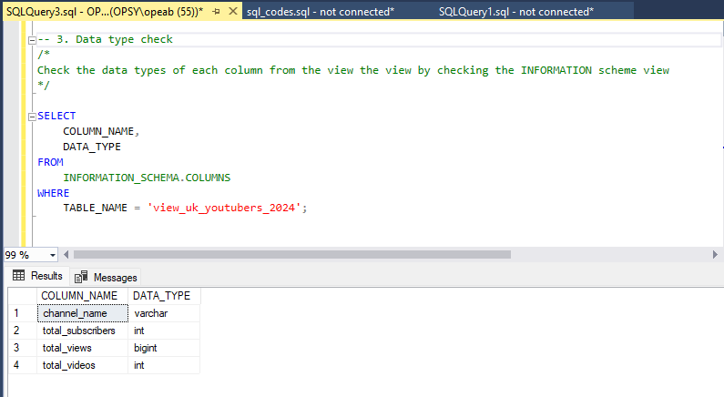

# Data Portflio: Excel to Power BI


# Table of Contents

- [Objective](#objective)
  - [User Story](#user-story)
- [Data Source](#data-source)
- [Stages](#stages)
- [Design](#design)
  - [Mockup](#mockup)
  - [Tools](#tools)
- [Development](#development)
  - [Pseudocode](pseudocode)
  - [Data Exploration](data-exploration)
  - [Data Cleaning](#datacleaning)
  - [Transform the Data](#tranform-the-Data)
  - [Create the SQL View](create-the-sql-view)
- [Testing](#testing)
  -[Data Quality Tests](#data-quality-tests)
- [Visualization](#visualization)
  -[Results](#results)
  -[DAX Measures](#dax-measures)
- [Analysis](#analysis)
  -[Findings](#findings)
  -[Validation](#validation)
  -[Discovery](#discovery)
- [Recommendation](#recommendations)
  -[Potential ROI](#potential-courses-of-action)
- [Conclusion](#conclusion)


# Objective

- What is the primary challenge?

The Head of Marketing aims to identify the top YouTubers of 2024 to plan effective marketing campaigns for the year.

- What is the best approach?

To build a dashboard that delivers insights into the top UK YouTubers in 2024, including their

- total views 
- subscribers
- total number of videos
- metrics for engagement
  
This will assist the marketing team in choosing which YouTubers to work with on their campaigns.

## User Story

As the Head of Marketing, I want to use a dashboard that analyses YouTube channel data in the UK .

This dashboard should allow me to identify the top performing channels based on metrics like subscriber base and average views.

With this information, I can make more informed decisions about which Youtubers are right to collaborate with, and therefore maximize how effective each marketing campaign is.

# Data Source

- What data is needed to achieve our objective?

We need data on the top UK YouTubers in 2024 that includes their 
- channel names
- total subscribers
- total views
- total videos uploaded

- Where is the data coming from? 
The data is sourced from Kaggle (an Excel extract), [see here to find it.](https://www.kaggle.com/datasets/anubhavbharti/top-100-youtube-channels-2024-12-countries?select=UK_Top100_YoutubeChannels.csv)

# Stages

- Design
- Developement
- Testing
- Analysis 
 
# Design

## Dashboard requirements

- What should the dashboard provide based on the specifications provided?
  
To determine what the dashboard should include, we first need to identify the key questions it needs to address:

1. Who are the top 10 YouTubers with the most subscribers?
2. Which 3 channels have uploaded the most videos?
3. Which 3 channels have the most views?
4. Which 3 channels have the highest average views per video?
5. Which 3 channels have the highest views per subscriber ratio?
6. Which 3 channels have the highest subscriber engagement rate per video uploaded?

For the time being, these are some of the questions we must address; but, as our analysis progresses, this may change.

## Dashboard mockup

- What the dashboard will look like?

The following data visuals will be most appropriate in providing solutions to the requirements:

1. Table
2. Treemap
3. Scorecards
4. Horizontal bar chart


## Tools

 | Tool| Purpose|
 | ---|---|
 | Excel | Exploring the data |
 | SQL Server | Cleaning, testing and analyzing the data |
 | Power BI | Visualizing the data via interactive dashboards |
 | GitHub | Hosting the project documentation and version control |
 | Mokkup AI | Designing the wireframe/mockup of the dashboard |


# Development

## Pseudocode

- The steps to be developing this solution from beginning to the end.

1. Get the data
2. Examine the data in Excel.
3. Load the data to SQL Server.
4. Use SQL to clean and test data.
5. Visualize the data in PowerBI.
6. Generate findings based on the insights
7. Produce the documentation, including commentary.
8. Publish the data in GitHub Pages.

## Data Exploration

At this stage, the data obtained is scanned for any errors, weird and corrupted characters, inconsistences e.t.c.

1. There are at least 4 columns that contain the data we need for this analysis, which signals we have everything we need from the file without needing to contact the 	client for any more data.
2. The first column contains the channel ID with what appears to be channel IDS, which are separated by a @ symbol - we need to extract the channel names from this.
3. Some of the cells and header names are in a different language - we need to confirm if these columns are needed, and if so, we need to address them.
4. We have more data than we need, so some of these columns would need to be removed

## Data Cleaning

How should the cleaned data be structured? (What should it contain, and what limitations should be applied?). Te goal of data cleaning is to ensure the dataset is properly organized and analysis-ready.

The cleaned data should meet the following criteria and constraints:
- Only relevant columns should be retained.
- All data types should be appropriate for the contents of each column.
- No column should contain null values, indicating complete data for all records.

Below is a table outlining the constraint on our cleaned dataset:

 | Property| Description |
 | ---|---|
 | ENumber of Rows | 100 |
 | Number of Columns | 4 |

And here is a tabular representation of the expected schema for the clean data:

 | Column Name| Data Type| Nullable |
 | ---|---| ---|
 | channel_name | VARCHAR | NO |
 | total_subscribers | INTEGER | NO |
 | total_views | INTEGER | NO |
 | total_videos | INTEGER | NO |

Therefore, the next step is to clean and shape the data into the preferred format as follows:

1. Just choose the columns you need, and eliminate any redundant ones.
2. Take the names of YouTube channels out of the first column.
3. Use aliases to change columns' names.

## Tranform the Data

```sql

/* 
1. Set the preferred columns
2. Extract channel name from the 'NOMBRE' column.
*/

SELECT 
	CAST(SUBSTRING(NOMBRE, 1,CHARINDEX('@', NOMBRE) -1) AS VARCHAR(100)) AS channel_name, 
	total_subscribers,
	total_views,
	total_videos
FROM youtube_data_from_python;
```

## Create the SQL view

```sql
/*
# 1. Create a view to store the transformed data
# 2. Cast the extracted channel name as VARCHAR(100) and elect the required columns from the top_uk_youtubers_2024 SQL table 
*/

-- 1. 
CREATE VIEW view_uk_youtubers_2024  AS


-- 2.
SELECT 
	CAST(SUBSTRING(NOMBRE, 1,CHARINDEX('@', NOMBRE) -1) AS VARCHAR(100)) AS channel_name,
	total_subscribers,
	total_views,
	total_videos
FROM
	youtube_data;

```

# Testing

The intention here is to ensure data quality and perform validation checks. Below are the data quality checks undertaken:

## Row count check

```sql
/*
# The data needs to be 100 records of Youtube channels (row count test)
*/

SELECT 
	COUNT(*) as no_of_rows
FROM 
	youtube_data
```


## Column check
```sql
-- 2. Column count check
/*

Confirm the total number of columns/fields in the SQL view
*/

SELECT 
	COUNT(*) AS column_count
FROM 
	INFORMATION_SCHEMA.COLUMNS
WHERE 
	TABLE_NAME = 'view_uk_youtubers_2024';
```


## Data type check

```sql
/* 
Check the data types of each column from the view the view by checking the INFORMATION scheme view
*/

SELECT
	COLUMN_NAME,
	DATA_TYPE
FROM
	INFORMATION_SCHEMA.COLUMNS
WHERE
	TABLE_NAME = 'view_uk_youtubers_2024';
```



```sql

SeLECT 
	*
FROM 
	youtube_data;

SeLECT 
	NOMBRE,
	total_subscribers,
	total_views,
	total_videos
FROM 
	youtube_data_from_python;
```

 | Col1 | Col2 | Col3|
 | ---|---|---|
 |Dan   |Foster|£5.00|	
